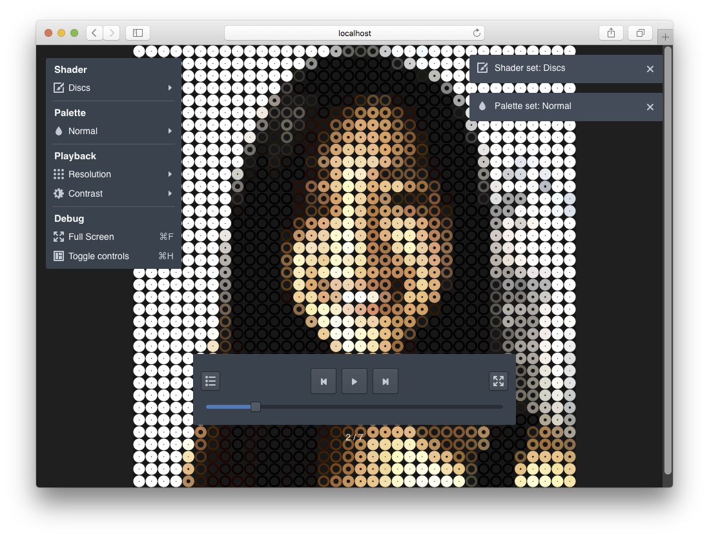

# Studio

A toolset and environment for generating 2D digital art and animations in the browser. See it working here: [studio](http://blog.zmitri.com/studio)



## Overview

Images are transformed into pixel data and rendered onto a canvas element using a shader, which determines what the canvas will look like, and a palette, which determine how the canvas will be colored.

## Shaders

In order to transform images into "art", you'll need some mechanism of turning basic pixel data into shapes. That is the primary job of the [Shader](https://en.wikipedia.org/wiki/Shader). Because we are dealing in simple 2D art, it makes sense to think of images as a simple 2D array.

In order to add a shader to the studio system, all you need is an object with the properties: `name`, and `render` -- a function that fits the following interface: `render(ctx, data, palette)`.

I have provided a base [Shader](src/Shaders/Shader.js) class that makes things a bit easier. For simple geometric shaders, where each pixel is independent of the others, all you'll need to do extend [Shader](src/Shaders/Shader.js) and override the function `renderPixel (ctx, pixel, data, palette)`. The simplest example of this is the [PixelShader](src/Shaders/PixelShader.js) which simply renders a square.

## Palettes

Palettes provide a simple way of applying a color scheme to your canvas. Instead of using the original color from your image, you can programmatically determine how you want a pixel colored with a palette.

I have provided a simple Palette interface [Palette](src/Palettes/Palette.js) and a simple [RulePalette](src/Palettes/RulePalette.js) which lets you test a set of rules to determine what color should be used. I've also created a simple helper function `stepColorPalette` to help you generate color ramp like `RulePalette`s with ease.

## Tools

You've probably heard the saying 'An artist is only as good as their tools'. I think it's a stupid quote tbh, but I've added some basic tools to help you take advantage of automation instead of manually performing repetitive actions... Isn't that what art is all about anyway?

### Resolution

The system can scale images up and down automatically, which can drastically change the look and feel.

You can change the resolution in the menu, using the up and down keys, or by pinching in and out.

### Contrast

The system can change contrast on the original image, which can drastically alter how something is colored.

You can change the contrast in the menu.

### Frames

Add and remove frames to the studio system via a simple interface in the browser.

You can edit frames by clicking the left most button in the toolbar.

### Fill and Stroke

By default most shaders in the system will 'fill' and 'stroke' the shapes made, but you can also toggle those on and off. With fill toggled off, you'll just have the outline of the shapes. For more complicated shaders, it's also a chance to make an alternative, but complimentary style.

You can toggle fill and stroke individually in the menu, or toggle fill by pressing the screen for around a quarter of a second.

### Player

You can easily play, pause, and navigate through the frames in studio.

You can start and stop the player with the play or pause button in the toggle bar, by hitting the space key on the keyboard, or by double tapping.

## How to install and run

The app is written in Javascript and relies on React. It's easy to get it going because everything is in the [package.json](package.json) file.

### Installation

```
npm install
```

### Run the app locally

```
npm run start
```

### Build for static use

```
npm run build
```

### Deploy to GitHub Pages
You first need set the `homepage` key to `http://{your-username}.github.io/studio` in your [package.json](package.json). Then run the build command to generate a version for GitHub pages. After it's built, you can deploy by running:

```
npm run deploy
```
